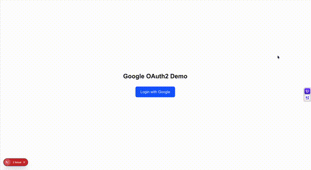

# Use Gemini with OAuth2 Scope

A Next.js demo app that calls the Gemini API on behalf of a user using Google OAuth2 access tokens — no API key required.

## Demo



## How It Works

1. User clicks **"Login with Google"** and authenticates via OAuth2
2. Google returns an access token with the `generative-language.retriever` scope
3. The app uses the access token + `x-goog-user-project` header to call the Gemini API directly
4. Gemini responses are streamed to the chat UI using the AI SDK's UIMessageStream protocol

## Prerequisites

- Node.js 18+
- A Google Cloud project with the **Generative Language API** enabled
- OAuth2 credentials (Web application type)

## Setup

### 1. Google Cloud Console

1. Go to [Google Cloud Console](https://console.cloud.google.com)
2. Enable the **Generative Language API** (`APIs & Services` > `Enable APIs and Services`)
3. Create OAuth2 credentials (`APIs & Services` > `Credentials` > `Create Credentials` > `OAuth client ID`)
   - Application type: **Web application**
   - Authorized redirect URIs: `http://localhost:3001/oauth2callback`
   - Authorized JavaScript origins: `http://localhost:3000`
4. Configure the OAuth consent screen:
   - Add scope: `https://www.googleapis.com/auth/generative-language.retriever`
   - Add your email as a **test user** (if in Testing mode)

### 2. Configure OAuth2 Secrets

Copy the example file and fill in your credentials:

```bash
cp oauth2-client-secret-example.json oauth2-client-secret.json
```

Edit `oauth2-client-secret.json` with your actual `client_id`, `project_id`, and `client_secret`.

### 3. Update Project ID

In `my-app/app/api/chat/route.ts`, replace the `x-goog-user-project` value with your Google Cloud project ID:

```ts
"x-goog-user-project": "your-project-id",
```

### 4. Install and Run

```bash
cd my-app
npm install
npm run dev
```

Open [http://localhost:3001](http://localhost:3001) and click **Login with Google**.

## Tech Stack

- **Next.js 16** — App Router with server components
- **@google/genai** — Google Generative AI SDK
- **AI SDK (Vercel)** — `useChat` hook + UIMessageStream protocol for streaming
- **Tailwind CSS 4** — Styling

## Project Structure

```
├── oauth2-client-secret.json        # Your OAuth2 credentials (gitignored)
├── oauth2-client-secret-example.json
├── demo.mov
└── my-app/
    ├── app/
    │   ├── page.tsx                  # Login page with OAuth2 redirect
    │   ├── profile/page.tsx          # User info + Chat UI
    │   ├── oauth2callback/route.ts   # OAuth2 token exchange
    │   ├── api/chat/route.ts         # Gemini API streaming proxy
    │   ├── components/Chat.tsx       # Chat component with useChat
    │   ├── layout.tsx
    │   └── globals.css
    └── package.json
```

## Key OAuth2 Scope

| Scope | Purpose |
|-------|---------|
| `openid email` | Basic user identity |
| `https://www.googleapis.com/auth/generative-language.retriever` | Access Gemini API on behalf of the user |
